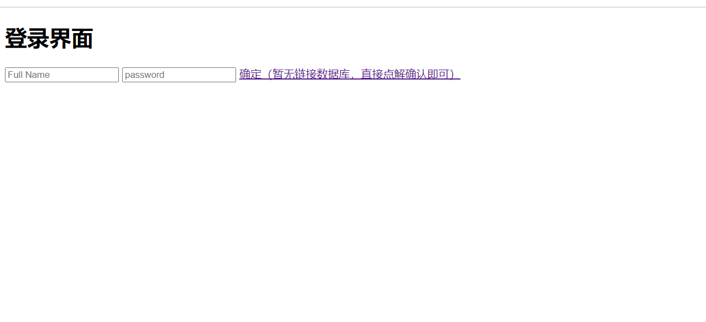
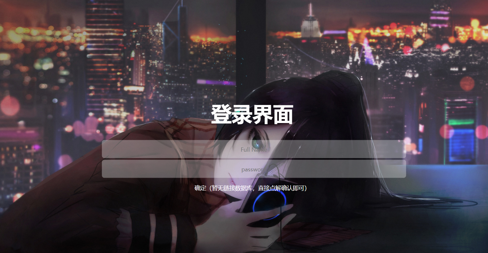

# CSS学习总结
###
> CSS 指的是层叠样式表* (Cascading Style Sheets)
  CSS 描述了如何在屏幕、纸张或其他媒体上显示 HTML 元素
  CSS 节省了大量工作。它可以同时控制多张网页的布局
  外部样式表存储在 CSS 文件中
  *：也称级联样式表。
* 
> 下面，我来说一说CSS选择器
> 可分为

  1. 群组选择器  如：p, body, img, div{}

  2. 兄弟选择器  如：p + p { color:#f00; }

  3. 属性选择器  如： p[title] { color:#f00; }

  4. 包含（后代）选择器  如：body ul li{}

  5. 子元素选择器 如：div > p{}

  6. ID选择器  如：#myDiv{}

  7. 类选择器  如：.class1{}

  8. 伪元素选择器  如：E:first-line，E:before

  9. 伪类选择器  如：E:first-child ，E:visited，E:focus，E:enabled

  10. 标签选择器  如：p { font-size:1em; }
  > 其中子选择器和后代选择器的区别：

    后代选择器的写法就是把外层的标记写在前面，内层的标记
    写在后面，之间用空格分隔。
    子选择器只对直接后代有影响的选择器，而对“孙子后代”以
    及多层后代不产生作用。
  11.  例子
  > 在此，我介绍一个例子：
   * 这是没有加CSS的一般网页：
     
   * 这是加了之后的：
    
  * 总结
   >本次学习让我了解了如何创建样式表来同 时控制多重页面的样式和布局。同时我也学会了CSS 来添加背景、格式化文本、以及格式化边框，并定义元素的填充和边距。当然，如何定位元素、控制元素的可见性和尺寸、设置元素的形状、将一个元素置于另一个之后，以及向某些选择器添加特殊的效果，比如链接，这些我也掌握了。凭借这些知识，我能做一个好看的小网站。